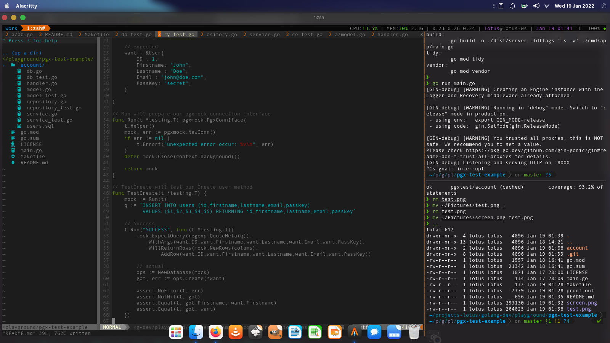
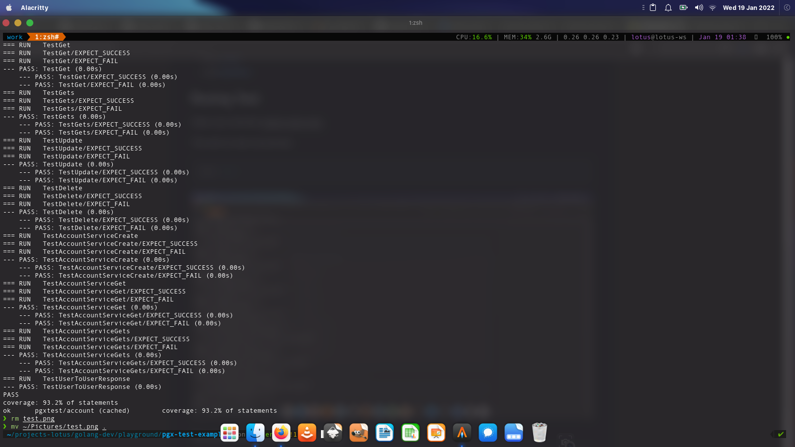
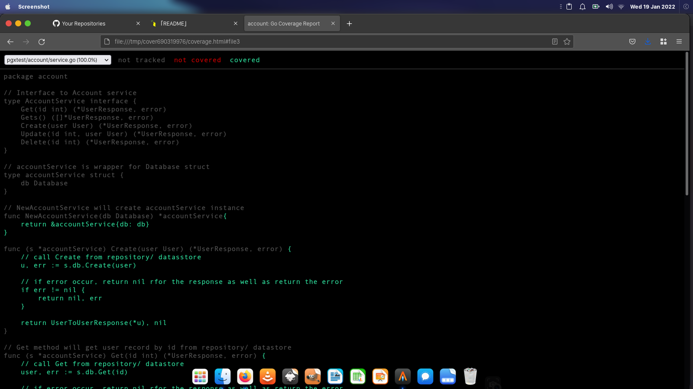

# Golang GIN and PGX Test example

<p align="center">
  
</p>

This is simple [Golang](https://golang.org) test example using [Gin](1), and [pgx](2) driver for [PostgreSQL](https://postgresql.org). This simple example project also was a reminder for me in case I need to do same test using similar stack in the future (as for few days ago, i am really stuck testing my project and dig out my brain searching here and there for completing the testing task). Hopefully it will help you too.


#### Package used in this test project:
- [x] [Gin](1)
- [x] [Pgx](2)
- [x] [Testify](3)
- [x] [PgxMock](4)


### Runing Test

Open your terminal `bash, zsh, etc`

#### This will run test via terminal

```bash
make test
```
<p align="center">
  
</p>


#### This will show the test with cover in browser

```bash
make test-cover
```
<p align="center">
  
</p>

Or if you already have the `proof.out` file from previous generated test, and you want to see the coverage profile on browser, run:

```bash
make show-test-cover
```
### Running Local Server

```bash
make run
```

The local server will be running on `http://127.0.0.1:8000`
Available api endpoint for the local server:

| No | Method | Endpoint | Description |
|----|--------|----------|-------------|
| 1 | `POST` | `/v1/account/` | Create/ insert new user data |
| 2 | `GET`  | `/v1/account/:id` | Get data by `ID` |
| 3 | `GET` | `/v1/account/` | Get all user data |
| 4 | `PUT` | `/v1/account/:id` | Update user data based on its `ID` |
| 5 | `DELETE` | `/v1/account/:id` | Delete user data based on its `ID` |

---

#### Playing with api operation (using `curl`):


```bash
# POST/ create new user data

curl http://127.0.0.1:8000/v1/account/ -X POST -H 'content-type: application/json' \
--data '{"firstname":"john","lastname":"doe","email":"john@doe.com","passkey":"secret"}'
# Server response
# {"id":1,"first_name":"john","last_name":"doe","email":"john@doe.com"}

curl http://127.0.0.1:8000/v1/account/ -X POST -H 'content-type: application/json' \
--data '{"firstname":"janne","lastname":"doe","email":"janne@doe.com","passkey":"secret"}'
# Server response
# {"id":2,"first_name":"janne","last_name":"doe","email":"janne@doe.com"}

curl http://127.0.0.1:8000/v1/account/ -X POST -H 'content-type: application/json' \
--data '{"firstname":"donny","lastname":"trumpy","email":"donny@trumpy.com","passkey":"secret"}'
# Server response
# {"id":3,"firstname":"donny","lastname":"trumpy","email":"donny@trumpy.com"}
```

```bash
# UPDATE DATA

curl http://127.0.0.1:8000/v1/account/2 -X PUT -H 'content-type: application/json' \
--data '{"id":2,"firstname":"janne","lastname":"sweety","email":"janne@doe.com","passkey":"secret"}'
# Server response
# {"id":2,"firstname":"janne","lastname":"sweety","email":"janne@doe.com"}
```


```bash
# GET DATA by ID

curl http://127.0.0.1:8000/v1/account/2
# Server response
# {"id":2,"first_name":"janne","last_name":"sweety","email":"janne@doe.com"}

curl http://127.0.0.1:8000/v1/account/1                                                
# Server response
# {"id":1,"first_name":"john","last_name":"doe","email":"john@doe.com"}


# GET ALL DATA

curl http://127.0.0.1:8000/v1/account/                                                 
# Server response
#[{"id":1,"first_name":"john","last_name":"doe","email":"john@doe.com"},{"id":2,"first_name":"janne","last_name":"sweety","email":"janne@doe.com"},{"id":3,"firstname":"donny","lastname":"trumpy","email":"donny@trumpy.com"}]
```


```bash
# DELETE DATA

curl http://127.0.0.1:8000/v1/account/1 -X DELETE
# Server response
# {"id":1,"first_name":"john","last_name":"doe","email":"john@doe.com"}
```
### Build Application

```bash
make build
```

## LICENSE
[MIT](https://github.com/reshimahendra/gin-starter/blob/main/LICENSE)

[1]:https://github.com/gin-gonic/gin
[2]:https://github.com/jackc/pgx/v4
[3]:https://github.com/stretcr/testify
[4]:https://github.com/pashagolub/pgxmock
